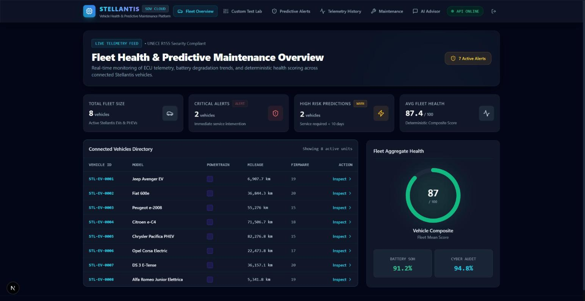
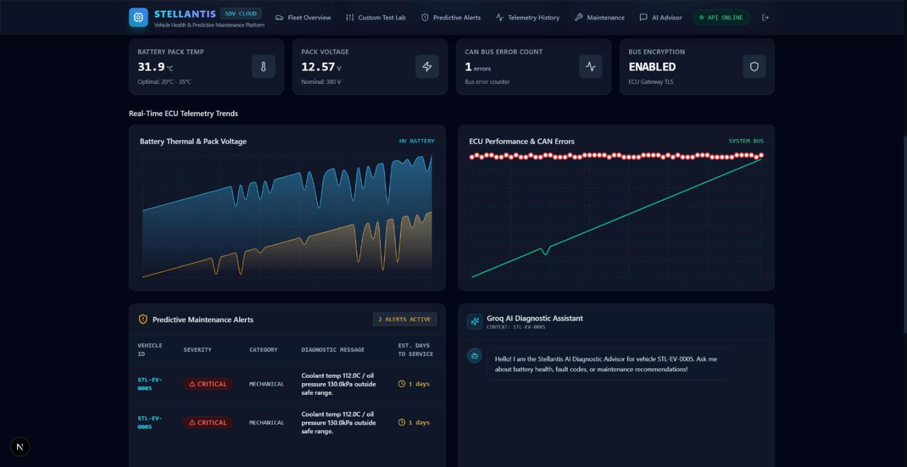
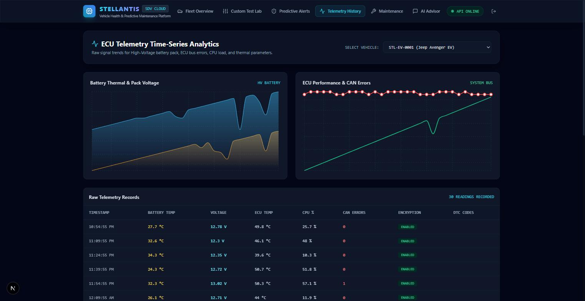
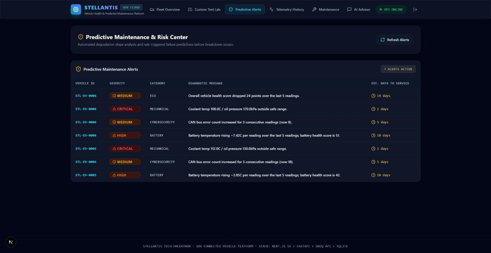
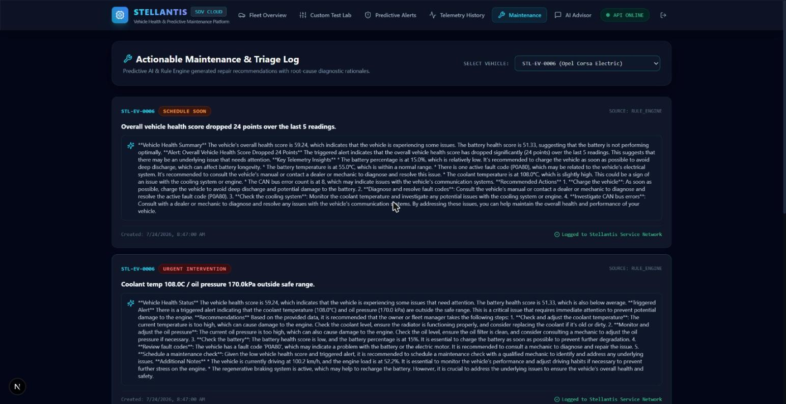
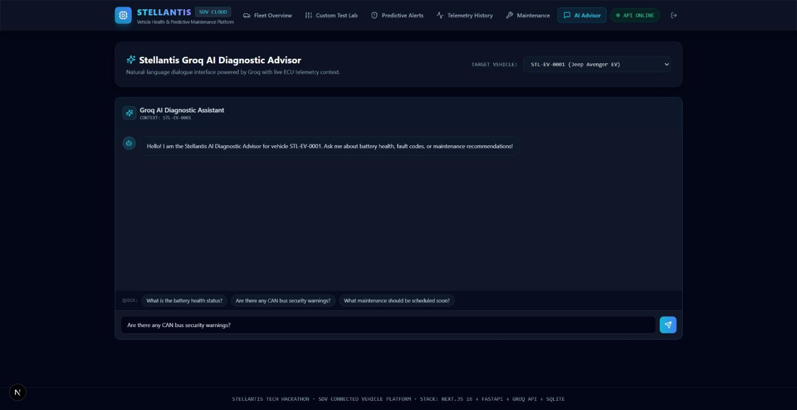
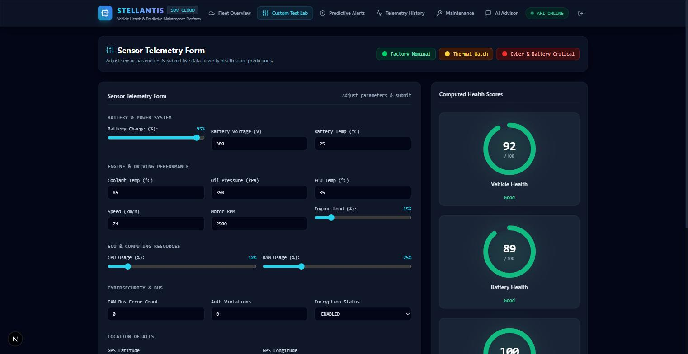
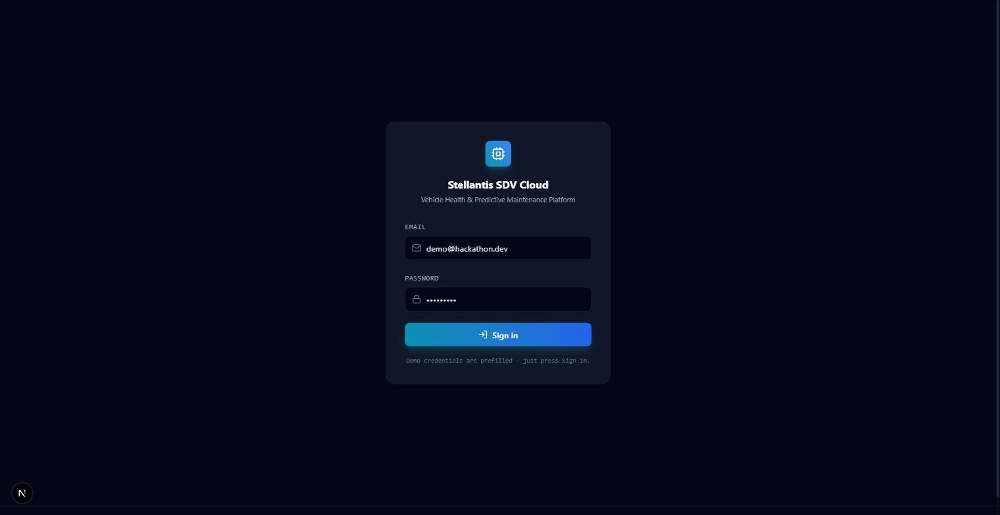

# Stellantis Hackathon Project — Cloud-Based Vehicle Health Dashboard

A full-stack project built by a 5-person team for the Stellantis Tech Hackathon. This README is the single source of truth for branching and day-to-day Git workflow — read it before your first commit.

> **Status:** Built and demo-ready. The MVP is a **Cloud-Based Vehicle Health Dashboard**: deterministic battery/cybersecurity/overall health scoring, a trend-based predictive maintenance engine, and a Groq-powered explanation/chat layer on top of already-computed scores. See `docs/Vehicle-Health-Dashboard-Plan.md` for the full architecture and scoring spec, and `docs/presentation/` for pitch materials. Each of `frontend/`, `backend/`, and `ai/` has its own README with setup and structure detail.

## Table of Contents

- [Screenshots](#screenshots)
- [Tech Stack](#tech-stack)
- [Repository Structure](#repository-structure)
- [Getting Started](#getting-started)
- [Branch Strategy](#branch-strategy)
- [Team Roles & Folder Ownership](#team-roles--folder-ownership)
- [Git Workflow](#git-workflow)
- [Commit Message Conventions](#commit-message-conventions)
- [Pull Request Workflow](#pull-request-workflow)
- [Conflict Resolution](#conflict-resolution)
- [Emergency Recovery](#emergency-recovery)
- [Deployment](#deployment)

## Screenshots

| | |
|---|---|
| **Fleet Overview** — fleet-wide health scores, alert counts, connected vehicles directory | **Vehicle Detail** — 3 health gauges, live telemetry, AI diagnostic summary, NHTSA recalls, weather, nearby charging |
|  |  |
| **Telemetry History** — raw ECU time-series charts + reading-by-reading table | **Predictive Alerts** — severity-ranked, slope-of-degradation alerts fleet-wide |
|  |  |
| **Maintenance** — AI-explained recommendations per triggered alert | **AI Advisor** — freeform chat grounded in a vehicle's live scores + telemetry |
|  |  |
| **Custom Test Lab** — sliders/presets recompute health scores live, no reload | **Login** — JWT-authenticated demo access |
|  |  |

## Tech Stack

| Layer      | Technology                              |
|------------|------------------------------------------|
| Frontend   | Next.js (App Router), React, Tailwind CSS, Recharts |
| Backend    | FastAPI, Python, SQLAlchemy, JWT auth    |
| AI         | Groq LLM API (explanation/chat layer only — never computes scores) |
| Database   | SQLite (single file — no separate DB service to run) |
| Deployment | Vercel (frontend), Render/Fly.io (backend) |

## Repository Structure

```
project/
├── frontend/               # Next.js + React + Tailwind app
│   ├── src/
│   └── public/
├── backend/                 # FastAPI service
│   ├── app/
│   └── tests/
├── ai/                       # Groq explanation/chat client (imported by backend)
│   ├── src/
│   └── notebooks/
├── docs/                     # Architecture docs & presentation notes
│   ├── architecture/
│   └── presentation/
├── assets/                   # Shared images, diagrams, brand assets
├── .github/
│   ├── ISSUE_TEMPLATE/
│   └── PULL_REQUEST_TEMPLATE.md
├── README.md
├── CONTRIBUTING.md
├── LICENSE
└── .gitignore
```

## Getting Started

### Prerequisites (install before hackathon day)

- Git
- Node.js 18+ and npm/pnpm
- Python 3.11+
- A Groq API key (SQLite needs no separate database server — it's a single file)

### Clone the repository

```bash
git clone https://github.com/<org>/<repo>.git
cd <repo>
```

### Quickstart

```bash
docker compose up --build
```

Brings up the FastAPI backend (http://localhost:8000/docs for Swagger) and the Next.js frontend (http://localhost:3000) together — SQLite is a file inside the backend container/volume, so there's no separate database service. Or run each service standalone with the scripts in `scripts/` — see `scripts/README.md`. Each of `frontend/`, `backend/`, and `ai/` has its own README with setup and structure detail.

### While you're getting oriented

- `datasets/` — mock vehicle/battery/maintenance/fleet JSON data (ready now) + links to real public datasets
- `docs/cheatsheets/` — one-page references for Git, FastAPI, React/Tailwind, SQL, Docker
- `docs/presentation/` — pitch kit, demo notes, and the full project explainer deck/doc

## Branch Strategy

The repository uses **5 long-lived branches**. `main` is protected — no one commits to it directly.

| Branch        | Purpose                                              |
|----------------|-------------------------------------------------------|
| `main`         | Production-ready, always-deployable code. Protected. |
| `frontend`     | Next.js/React/Tailwind feature work.                  |
| `backend`      | FastAPI service development.                          |
| `ai`           | Gemini/LangChain/ChromaDB pipeline work.              |
| `integration`  | Where frontend + backend + ai are wired together and smoke-tested before merging to `main`. |

Everyone branches personal work **off of** their team branch (e.g. `frontend/navbar-fix`), not off `main` directly.

```
main  ◄── integration  ◄── frontend / backend / ai  ◄── feature branches (per developer)
```

## Team Roles & Folder Ownership

| Member | Primary Branch | Owns Folder(s)      | Focus                                  |
|--------|-----------------|----------------------|-----------------------------------------|
| Dev 1  | `frontend`      | `frontend/`          | UI components, pages, styling           |
| Dev 2  | `frontend`      | `frontend/`          | State management, API integration       |
| Dev 3  | `backend`       | `backend/`           | REST API, DB models, auth                |
| Dev 4  | `ai`            | `ai/`                | Groq client, prompt engineering, explanation/chat logic |
| Dev 5  | `integration`   | `docs/`, root config | Wiring services together, deployment, docs, demo prep |

Ownership is about primary responsibility, not an exclusive lock — anyone can touch any folder via a PR reviewed by the folder's owner.

## Git Workflow

### Repository Creation (done once, by whoever sets up the repo)

```bash
git init
git add .
git commit -m "Initial commit"
git branch -M main
git remote add origin https://github.com/<org>/<repo>.git
git push -u origin main
```

### Branch Creation (done once, pushed by the repo owner)

```bash
git checkout -b frontend
git push -u origin frontend

git checkout -b backend
git push -u origin backend

git checkout -b ai
git push -u origin ai

git checkout -b integration
git push -u origin integration
```

### Every Developer: First-Time Setup

```bash
git clone https://github.com/<org>/<repo>.git
cd <repo>
git checkout <your-branch>       # frontend / backend / ai / integration
git checkout -b <your-branch>/<your-name>-<feature>
# e.g. git checkout -b frontend/alex-navbar
```

### Daily Workflow (every developer, every day)

```bash
git checkout <your-branch>
git pull origin main              # or git pull origin <your-branch> for the shared team branch
git add .
git commit -m "Meaningful message"
git push origin <branch>
```

Concretely, for a feature branch:

```bash
git checkout frontend/alex-navbar
git fetch origin
git merge origin/frontend          # stay in sync with your team branch
git add .
git commit -m "feat(frontend): add responsive navbar"
git push origin frontend/alex-navbar
```

Then open a PR: `frontend/alex-navbar` → `frontend`.

### Merge Workflow (team branch → main, done via reviewed PR only)

```bash
git checkout main
git pull origin main
git merge <branch>
git push origin main
```

In practice this happens through `integration → main` after each team branch has been merged into `integration` and smoke-tested, all via Pull Requests — never a direct local push to `main`.

## Commit Message Conventions

Use [Conventional Commits](https://www.conventionalcommits.org/):

```
<type>(<scope>): <short summary>
```

| Type       | Use for                                      |
|------------|-----------------------------------------------|
| `feat`     | New feature                                   |
| `fix`      | Bug fix                                       |
| `docs`     | Documentation only                            |
| `style`    | Formatting, no logic change                   |
| `refactor` | Code change that neither fixes nor adds       |
| `test`     | Adding/updating tests                         |
| `chore`    | Tooling, deps, config                         |

Examples:

```
feat(backend): add /api/chat endpoint
fix(frontend): correct button alignment on mobile
docs(ai): document RAG pipeline setup
chore(integration): update docker-compose ports
```

## Pull Request Workflow

1. Push your feature branch: `git push origin <branch>/<name>-<feature>`.
2. Open a PR into your **team branch** (`frontend`, `backend`, or `ai`) — not into `main`.
3. Fill out the PR template (auto-loaded from `.github/PULL_REQUEST_TEMPLATE.md`).
4. Request review from at least 1 teammate (ideally the folder owner).
5. Resolve review comments, keep the PR small and focused.
6. Once approved, merge into the team branch.
7. Periodically, the `integration` owner opens a PR: `frontend`/`backend`/`ai` → `integration`.
8. After integration testing passes, open a final PR: `integration` → `main`.
9. `main` requires PR + at least 1 approval + passing checks (branch protection — see below).

### Recommended GitHub branch protection for `main`

In GitHub: **Settings → Branches → Add rule** for `main`:
- Require a pull request before merging
- Require at least 1 approval
- Require status checks to pass (if CI is set up)
- Do not allow force pushes
- Do not allow deletions

## Conflict Resolution

```bash
git checkout <your-branch>
git pull origin <target-branch>     # e.g. pull latest frontend into your feature branch
# Git reports conflicting files
```

1. Open each conflicting file — look for `<<<<<<<`, `=======`, `>>>>>>>` markers.
2. Decide which changes to keep (yours, theirs, or a manual combination). Talk to the other author if unclear.
3. Remove the conflict markers once resolved.
4. Stage and continue:

```bash
git add <resolved-files>
git commit -m "fix: resolve merge conflict in <area>"
git push origin <your-branch>
```

**To avoid conflicts in the first place:**
- Pull/merge from your team branch at the start of every session, not just before pushing.
- Keep PRs small and short-lived (merge within a day).
- Don't edit files outside your owned folder without a heads-up in the team chat.
- Communicate before touching shared config files (`package.json`, `requirements.txt`, `docker-compose.yml`).

## Emergency Recovery

If someone force-pushes over your work or you lose commits:

**1. Recover from reflog (local, most common case):**
```bash
git reflog
git checkout -b recovery-branch <commit-hash-from-reflog>
```

**2. Recover a branch that was deleted on GitHub but still exists locally:**
```bash
git push origin <local-branch-name>:<branch-name>
```

**3. Recover if `main` was force-pushed and you have an old local copy:**
```bash
git fetch origin
git checkout -b main-recovery origin/main
# compare against your last known-good local main
git log main-recovery..main   # see what's missing
# cherry-pick or push the missing commits back via a PR — never force-push main directly
```

**4. Recover uncommitted work you stashed and forgot:**
```bash
git stash list
git stash apply stash@{0}
```

**5. If a file was deleted and committed:**
```bash
git log --all --full-history -- "**/<filename>"
git checkout <commit-hash> -- <path-to-file>
```

**Golden rule:** never run `git push --force` on a shared branch (`main`, `frontend`, `backend`, `ai`, `integration`). If a force push is truly needed, use `git push --force-with-lease` and only after telling the team, and never on `main`.

## Deployment

- **Frontend** → Vercel, auto-deploys from `main` (Preview deploys can be wired to `integration` for staging).
- **Backend** → Render or Fly.io, auto-deploys from `main`.
- **Database** → SQLite file (`backend/app.db`), persisted via a Docker volume or the backend host's filesystem — no separate managed DB instance needed at this scale.

See `docs/architecture/` for system diagrams and `docs/presentation/` for demo-day materials.
